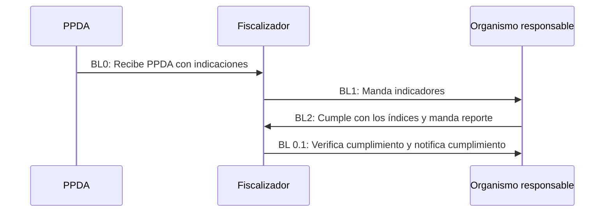
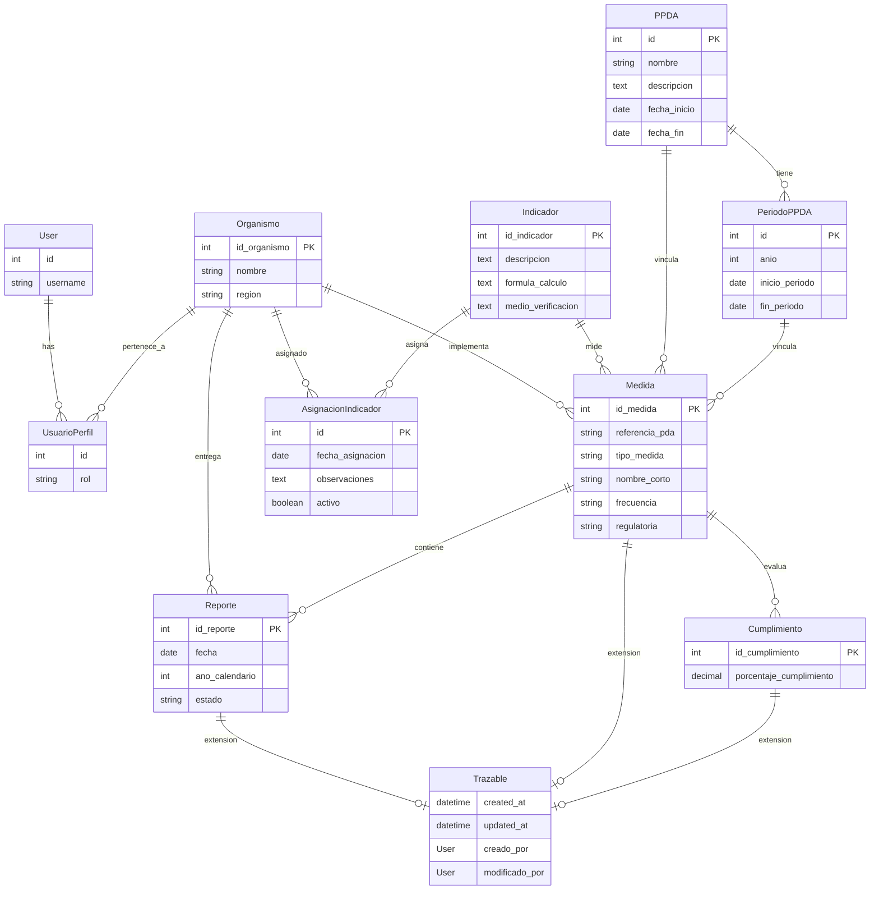

# Feedback: curso Backend en Python de Talento Futuro, Corfo.

Este es un repositorio que contiene el proyecto del curso Backend en Python de Talento Futuro, Corfo. 

## **I. Sprint 1 - Semana 1 (30 de enero al 15 de febrero):**
**Tareas del equipo**:
|Tarea|Responsable(s)|Fecha entrega|Finalizado|
|-----|--------|-------------|---|
|Avance HU (en Taiga y otra herramienta similar) | Bryan |01FEB|<ul><li> [X] Finalizado</li><ul> |
|Avance de normalizacion de datos | Scarlett| 31ENER - 01FEB| <ul><li> [X] Finalizado</li><ul> |
|Avance de código Core 1(Django| Manuel | 31ENE - 02FEB - 03FEB| <ul><li> [X] Finalizado</li><ul>|
|Avance de código Core 2(Django)| Ulises | 31ENE - 02FEB - 03FEB| <ul><li> [X] Finalizado</li><ul>|
|Testing Carol - Bryan | Carol (Tester)| 31ENE - 02FEB - 03FEB| <ul><li> [X] Finalizado</li><ul>|
|Documentación de APIs (Swagger)| Manuel - Ulises | 02FEB | <ul><li> [X] Finalizado</li><ul> |
|Demo funcional en video (link a YouTube, oculto)| Ulises - Bryan| 03FEB-04FEB-05FEB|<ul><li> [X] Finalizado</li><ul>|

- [X] LUNES 03 FEBRERO: AMISTOSOS RECORDATORIOS 
- [X] LUNES 10 FEBRERO: REVISIÓN - ENTREGABLES 
- [X] LUNES 10 FEBRERO: EMPAQUETAMIENTO - VIDEO - COORDINA LA ENTREGA EL COMO 

La revisión y reporte de este Sprint estarán disponibles en el siguiente [link](/administrativo/revisiones)
## **CHANGELOG**
Para ver los cambios y mejoras desde la versión 1 hasta ahora visita por favor el [CHANGELOG](https://github.com/bwcastillo/proyecto_backend_tf/blob/master/CHANGELOG.md)
Considera que esta nueva versión utiliza Basicauth.

## **I.ii Sprint 2 - Semana (Viernes 28 de marzo al 09 de febrero):**
**Tareas del equipo**:
|Tarea|Responsable(s)|Fecha entrega|Finalizado|
|-----|--------|-------------|---|
|Actualización documentación| Bryan |28 MAR al 09FEB|<ul><li> [X] Finalizado</li><ul> |
|Testing de la aplicación |Scarlett-Geraldy-Nicolás |28 MAR al 09FEB| <ul><li> [X] Finalizado</li><ul> |
|Desarrollo lógica negocio Organismos con responsabilidad sectorial| Manuel |28 MAR al 09FEB| <ul><li> [X] Finalizado</li><ul>|
|Scrum master y enviar segunda entrega| Ulises |28 MAR al 09FEB| <ul><li> [X] Finalizado</li><ul>|

## **II. Lógica del negocio y Backlogs**




<br>

## **III. Backlog:** 


**Parte 0**
- Llega resolucion
- Cada artículo de la resolución es un organismo con una tabla de responsabilidades.
- El fiscalizador tiene que mandar las tablas a cada organismo responsable

**Tareas Core 1 (Fiscalizador | Encargado: Manuel D.):**
- Poder introducir/elegir organismos
- Escribirles las tareas(indicadores) a los organismos responsable
- Mandar las tareas y los respectivos indicadores a los organismos responsables

**Tareas Core 2 (Entidad responsable | Encargado: Ulises C.:**
- COMO CLIENTE (ORGANISMO RESPONSABLE)
- IDEALMENTE QUIERO SER NOTIFICADO CON LAS MEDIDAS QUE TENGO COMO CUMPLIR
Y CON UN DEAD LINE (FRECUENCIA DEL REPORTE)

**Tareas parte 3 (por definir):**
- COMO CLIENTE UNA VEZ REALICE LAS MEDIDAS QUIERO POSTEARLAS AL FISCALIZADOR

**Lujo Bonus track):**
- Parte 0
- PEDIR PRORROGA
-	FISCALIZADOR APRUEBA TERMINADO
-	FISCALIZADOR APRUEBA DA PRORROGA (PREGUNTAR A STANLEY)
-	FISCALIZADOR DA CUENTA NO CUMPLE
    - SI NO CUMPLE MANDA RECORDATORIO O MULTA (REVISAR)

## Historia
1) Yo como fiscalizador tengo que ingresar los organismos sectoriales y las medidas que deben cumplir.
2) Idealmente, como fiscalizador debo notificar a los organismos sectoriales. 
3) Como organismo sectorial debo entrar a una url y saber cuales son las medidas que debo cumplir, y cuales son prioritarias.
4) Como organismo sectorial una vez cumpla las medidas debo enviárselas al fiscalizador.
5) Como fiscalizador debo verificar que el organismo sectorial cumplió con las medidas.
6) Como fiscalizador debo devolver las medidas que no están cumplidas.
7) Como organismo sectorial debo pedir más plazo si no logro cumplir con las medidas. 

--

## **IV. Modelo relacional de datos**




## **V. Instalación y uso**

Para instalar el proyecto, sigue estos pasos:

### 1. Clonar el repositorio

```bash
git clone hhttps://github.com/bwcastillo/proyecto_backend_tf
cd proyecto_backend_tf/proyecto_django/
```

### 2. Crear un entorno virtual

```bash
python -m venv venv
source venv/bin/activate  # En Linux/Mac
# o
venv\Scripts\activate  # En Windows
```

### 3. Instalar dependencias

```bash
pip install -r requirements.txt
```

### 4. Configurar la base de datos
- Asegúrate de tener PostgreSQL instalado y en funcionamiento.
- Crea una base de datos para el proyecto.
- Configura la conexión a la base de datos en el archivo `settings.py` de Django.

### 5. Ejecutar migraciones

```bash
python manage.py makemigrations
python manage.py migrate
```

### 6 De ser necesario, crear un superusuario para acceder al panel de administración de Django:

```bash
python manage.py createsuperuser
```

### 7. Ejecutar el servidor de desarrollo

```bash
python manage.py runserver
```

### 8. Para ver documentación ingresar al link

http://127.0.0.1:8000/api/docs/
