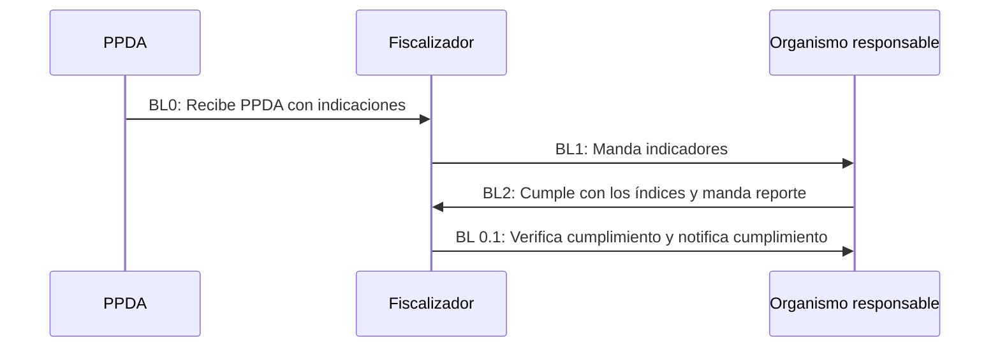

## Feedback: curso Backend en Python de Talento Futuro, Corfo.

Este es un repositorio que contiene el proyecto del curso Backend en Python de Talento Futuro, Corfo. 

### Semana 1 (30 de enero al 06 de febrero):
**Tareas del equipo**:
|Tarea|Responsable(s)|Fecha entrega|
|-----|--------|-------------|
|Avance HU (en Taiga y otra herramienta similar) | Bryan |01FEB|
|Avance de modelo de datos | Scarlett| 31ENER - 01FEB| 
|Avance de código (Django o FastAPI)| Manuel (Parte 1) - Ulises (Parte 2) - Carol (Tester)| 31ENE - 02FEB - 03FEB|
|Documentación de APIs (Swagger)| Manuel - Ulises | 02FEB |
|Demo funcional en video (link a YouTube, oculto)| Ulises - Bryan| 03FEB-04FEB-05FEB|

- LUNES 03 FEBRERO: AMISTOSOS RECORDATORIOS
- MARTES 04 FEBRERO: REVISIÓN - ENTREGABLES 
- MIÉRCOLES 05 FEBRERO: EMPAQUETAMIENTO - VIDEO - COORDINA LA ENTREGA EL COMO

## **Lógica del negocio y Backlogs**

 

### **BACKLOG:** 

 

**CORE - Desarrollo o avance de código:**

 

Parte 0
- Llega resolucion
- Cada artículo de la resolución es un organismo con una tabla de responsabilidades.
- El fiscalizador tiene que mandar las tablas a cada organismo responsable

Tareas Parte 1 (Fiscalizador) (Encargado - Manuel D.):
- Poder introducir/elegir organismos
- Escribirles las tareas(indicadores) a los organismos responsable
- Mandar las tareas y los respectivos indicadores a los organismos responsables

Tareas parte 2 (Organismo responsable |Encargado - Ulises C.:
- COMO CLIENTE (ORGANISMO RESPONSABLE)
- IDEALMENTE QUIERO SER NOTIFICADO CON LAS MEDIDAS QUE TENGO COMO CUMPLIR
Y CON UN DEAD LINE (FRECUENCIA DEL REPORTE)

Tareas parte 3 (por definir):
- COMO CLIENTE UNA VEZ REALICE LAS MEDIDAS QUIERO POSTEARLAS AL FISCALIZADOR

Lujo (bonus track):
- PEDIR PRORROGA
-	FISCALIZADOR APRUEBA TERMINADO
-	FISCALIZADOR APRUEBA DA PRORROGA (PREGUNTAR A STANLEY)
-	FISCALIZADOR DA CUENTA NO CUMPLE
    - SI NO CUMPLE MANDA RECORDATORIO O MULTA (REVISAR)
